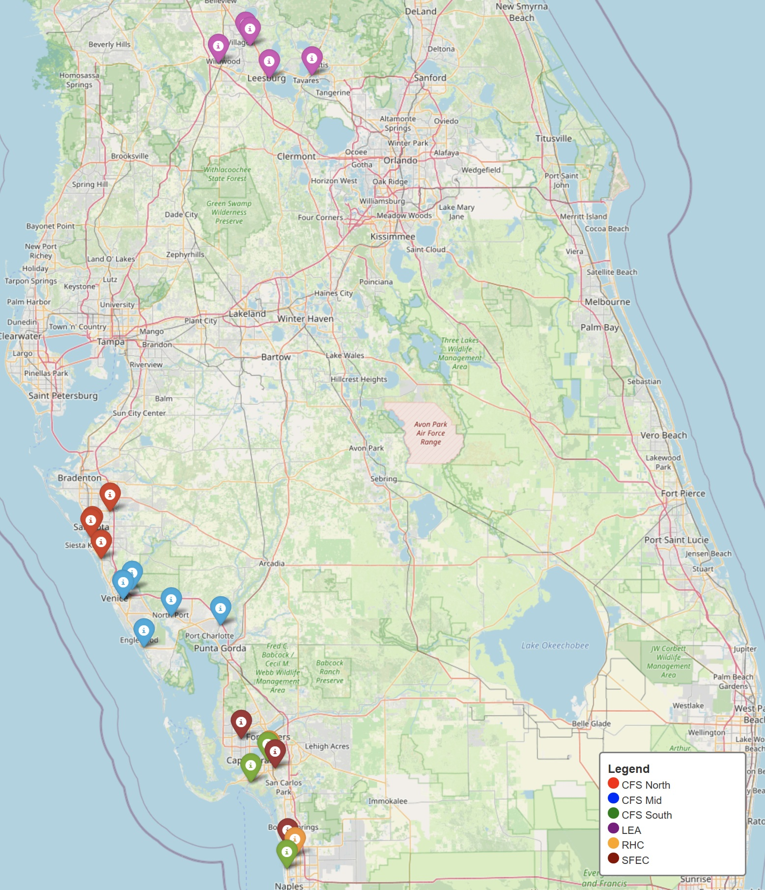

# Patient Access Center Master Guide

**Last Updated:** August 01, 2025

Note: For detailed navigation, please use the GitBook sidebar menu on the **right** 👉

## Introduction

The Florida Patient Access Center (PAC) serves as the centralized scheduling hub for multiple, Florida-based eye care practices within the US Eye network. This comprehensive guide provides the protocols, information, and scripting needed to accurately schedule appointments across all specialties and locations within Florida.

### Practice Locations (Florida)

US Eye encompasses the following practices:

1. **Center For Sight (CFS)**
   * 11 offices divided up into 3 regions/Patient Care Teams
     * CFS North
     * CFS Mid
     * CFS South
   * 2 ASCs (Ambulatory Surgery Centers: 1 in Sarasota, 1 in Naples)
   * Geographic span: Sarasota to Naples area
2. **Southwest Florida Eye Care (SFEC)**
   * 3 offices
   * Geographic span: Fort Myers to Naples area
3. **Lake Eye Associates (LEA)**
   * 5 offices
   * 1 ASC (Santa Fe Surgical Center aka SFSC)
   * Geographic span: The Villages and greater area
4. **Retina Health Center (RHC)**
   * 2 offices
   * Geographic span: Fort Myers to Naples area

### Map

_Click on the map below to access the interactive version_

### Websites (with physician biographies)

* **Center For Sight (CFS)**: [centerforsight.net](https://centerforsight.net/)
* **Southwest Florida Eye Care (SFEC)**: [swfleye.com/meet-our-physicians](https://www.swfleye.com/meet-our-physicians)
* **Lake Eye Associates (LEA)**: [lakeeye.com/physicians/](https://lakeeye.com/physicians/)
* **Retina Health Center (RHC)**: [retinahealthcenter.com](https://www.retinahealthcenter.com/)

### Translator
* Account number: 501036068
* Pin: 6483

## Provider, Location, and Dilation Guides

### Provider Reference

_This section contains detailed information about all providers across the organization. For the complete provider reference guide with specialties, patient types, office locations, and NPIs, please refer to the_ [_Provider Reference Guide document_](<Provider Reference Guide.md>)_._

### Location Reference

_This section contains detailed information about all locations. For the complete location reference guide with addresses, phone numbers, and hours, please refer to the_ [_Location Reference Guide document_](<Location Reference Guide.md>)_._

### Dilation Reference

_For a detailed list of dilated vs. non-dilated appointments and relevant patient scripting, please refer to the_ [_Dilation Key document_](<Dilation Key.md>)_._

## Referral Management Protocol

This protocol outlines the standard steps when scheduling patients who may or may not have a formal referral for specialty services (e.g., Cornea, Cataract, Dermatology, Glaucoma, Oculoplastics Medical, Refractive, Retina).

### If Patient Has Referral

1. **Verify Referral:** Check **Phreesia**, **ICP Documents,** and/or **E-Faxes** to confirm the referral exists and is for the appropriate specialty consultation.
2. **Obtain Missing Referral:** If the referral document is not found, **notify the patient** that it needs to be sent over by the referring office _before_ the consultation appointment. The appointment may possibly be rescheduled if the referral is not received on time.
3. **Schedule:** Schedule the appointment with the provider named on the referral, if specified.
   1. **Note:** Sometimes the provider listed on the referral is not accurate — Please correct if necessary.
   2. If no provider is specified, schedule with the first available appropriate specialist at the patient's preferred location.
4. **Document:** Note the referral source and status in the appropriate appointment details field (e.g., Physician Relations / Records in NextGen).

### If Patient Does NOT Have Referral (Self-Referral)

1. **Confirm Condition:** Ask the patient about their symptoms or reason for seeking a specialty consultation. Ask if they have been diagnosed with a relevant condition by a previous eye care provider (internal or external).
   * If the patient was seen internally, check **ICP** for notes indicating a diagnosis or recommendation for a specialty consult.
   * If the reason is unclear or seems more appropriate for Primary Eye Care (e.g., needs glasses update, no specific diagnosis), follow the [Scheduling Primary Eye Care](./#scheduling-primary-eye-care) protocol first.
2. **Records Requirement (external referrals to internal specialists):** Alert the patient that **medical records** from their previous eye exam(s) related to the condition **may be required** for a specialist consultation. Explain that the appointment may be rescheduled by the specialist's team if records are not received.
3. **Schedule Out & Mark:** Schedule the appointment at least **1 week out** to allow time for records to be sent and reviewed. Mark **"DNM" (Do Not Move)** in the appointment details to prevent automated systems from moving the appointment earlier.
4. **Document Records Status:** Document the records request status (e.g., "Records requested from Dr. Smith on \[date]", "Patient to bring records") in the Physician Relations / Records field or appointment notes.
5. **Provider Selection:** If the patient has no surgeon/specialist preference, offer the next available appointment with an appropriate specialist at the requested/most convenient location.
6. **Referring Physician Field:** Enter the **specialist's name** being scheduled in the _Referring Physician_ field in NextGen to indicate it's a self-referral handled internally. **This field should never be left blank.**

***

## Emergency Triage Protocol

### Instructions for Patient with Acute Issues

This protocol details the steps taken to properly triage and schedule a patient with an acute issue.  

**NO medical advice should be given to the patient by PAC agents.**

***

### Surgical Check (If Patient had Surgery in Last 30 Days)

**If the patient is having an emergency or urgent issue** (see below) **and has had surgery with one of our doctors in the past 30 days:**

* Attempt to schedule a **same-day** appointment.
* If no same-day slot is available, triage via **ICP** message to the **Patient Care Team**, mark it **URGENT**.
* OK to schedule in the grey if needed (but if after 3:30PM do not schedule and only send triage task to Patient Care Team).
* If the patient is **comanaged**, they should see their comanaging physician. If the comanaging doctor is not available and patient needs to be scheduled to another provider, or if the patient requests a different provider, note it in the appointment details.

***

### Identify Urgency & Scheduling Process

1. Ask about the **symptoms**.
2. Ask about the **duration** of these symptoms.
3. **Determine the urgency** (Emergency, Urgent, or Non-Urgent) via the table below.
4. Document all symptoms, which eye(s) they affect, and how long they've been present.

The following guide outlines when to schedule appointment based on their symptoms:

| Emergency (Same Day)                                                           | Urgent (24–48 hrs)                                         | Non-Urgent (Next Avail)                                             |
| ------------------------------------------------------------------------------ | ---------------------------------------------------------- | ------------------------------------------------------------------- |
| **Retinal Tear/Detachment (within 30 days)**                                   | Progressively worsening eye pain for 1 week                | Mild ocular irritation/redness                                      |
| **Sudden painless loss of vision**                                             | Moderate redness/pain for 1 week                           | Floaters (unchanged, previously diagnosed)                          |
| **Sudden onset of floaters/flashes/veil/spider webs**                          | Sub-acute loss of vision over a few days to 1 week         | Eyes become tired and blur after reading; trouble seeing road signs |
| **Sudden distortion/change on Amsler Grid**                                    | Sudden onset of double vision                              | Difficulty with near/fine print                                     |
| **Foreign body (something in eye)**                                            | Ocular discharge (clear, milky, watery)                    | Lid twitching                                                       |
| **Chemicals in eye** (flush at urgent care/hospital until pH = 7, then clinic) | Severe photophobia (with/without pain)                     | Mucous discharge                                                    |
| **Acute, rapid onset eye pain/discomfort**                                     |                                                            | Tearing (no other symptoms)                                         |
| **Acute red eye w/ or w/out discharge**                                        |                                                            | Mild redness w/o other symptoms                                     |
| **Trauma to eye, head, face**                                                  |                                                            | Loss of only pair of glasses/contacts needed for daily use          |
| **Referral stating emergent situation**                                        |                                                            |                                                                     |

***

### Emergency --> Same Day Appointment Required - Follow these instructions:

* **If New Patient**: Schedule with an **OD at CFS.**
  * **At LEA and SFEC, ODs or MDs see emergencies.**
* **If Established Patient:** Schedule with their **primary provider whenever possible**.
* If they are in a **post-op period** and **comanaged**, they should see their comanaging provider.

**Process**

* PAC schedules the **first available** opening (same day).
* If no ER spot is open, you may schedule in any open space (short or long)
* If no same day spots are available for that provider, send an **ICP** communication to the Patient Care Team of that region and mark **urgent**.
* If the patient's provider is out of the office, schedule with another provider in the region and note in the details their provider is out. **Check availability for all office locations in the region** **to include smaller satellite offices.**
* For **retina** patients (Dr. Banker or RHC): Triaged by an **OD first** for emergency appts. For retina emergency referrals (e.g. detachment or tear), send an **ICP** message to either Dr. Banker's team or RHC Pateint Care Team marked **urgent**. **Do not schedule**.
   - If this is a Dr. Banker patient that recently had an injection (2 weeks) and experiencing pain or decrease in vision, schedule them same day with an OD.
* If it's **3:30 PM–5:00 PM**:
  * Attempt a warm transfer to the office.
  * If the office is unavailable, enter an **ICP** message to the Patient Care Team. The office will contact the patient directly to schedule.
* If uncertain or unable to schedule, **notify** the Patient Care Team in ICP (if new patient, see "ICP IntelleChart – New Patient Task" below).
   - If a messaage is required to be sent, please make sure it is being sent to the proper **Patient Care Team** and include **all** details of symptoms.

***

### Urgent --> Appointment Within 48 Hours Required  - Follow these instructions:

* **If New Patient**: Schedule with **OD within 2 days** (although some MDs at SFEC and LEA see ERs as well)
* **If Established Patient**: Schedule with **primary provider whenever possible**.
* If in post-op/comanaged, see their comanaging provider if possible.

**Process**

* Schedule in the first available **orange ER spot** first.
* If unavailable orange ER spots, schedule for any 30 minute (long) spot that that provider has in next 48 hours.
* If unsure where to schedule, send **ICP** triage communication to the Patient Care Team in that region and mark **urgent**. Patient may need to see another provider if primary provider in the region is not available.

***

### Non-Urgent – Next Available  - Follow these instructions:

* **If New Patient**: Schedule with **OD**.
* **If Established Patient**: Schedule with **primary provider**. For more information about scheduling non-urgent established patients, see "[Scheduling Established Patients](./#scheduling-established-patients)".
* **If Problem Focused Visit**: Schedule with primary provider. Evaluation of a specific, non-emergent eye issue (e.g. dry eye, mild redness or irritation, eyelid problems). Scheduled based on availability; not time-critical. Scheduled in a **blue short spot.**

**Process**

* Schedule the patient in the next available spot (within 2 weeks).
* If unsure or no spots are available, triage via ICP to the Patient Care Team in that region.

> **Note**: Sudden difficulty with distance/near vision should be treated as an emergency.

***

### Routing to Patient Care Teams via ICP

If you need to **triage via ICP** instead of scheduling immediately, see the table below to find the regional Patient Care Team to send message to:

* `CFS North Region Patient Care Team`
* `CFS Mid Region Patient Care Team`
* `CFS South Region Patient Care Team`
* `SFEC Patient Care Team`
* `LEA Patient Care Team`
* `RHC Patient Care Team`

**Add the provider's name at the beginning of the message** if known.\
Use **clear, concise language**—avoid abbreviations.

Document eye(s) affected, symptom details, cause if known, and duration.

Mark as **URGENT** if needed

**Include the patient's preferred location and best callback number.**

Inform the patient that staff will call them to discuss their symptoms and urgency.

_Refer to **NextGen Transfer to ICP process** for new patient ICP tasks_

***

#### Additional Reminders

1. If symptoms worsen before the scheduled appointment, advise the patient to **call back** immediately
2. Explain to the patient that he/she will likely be dilated for an Emergency visit.
3. If the patient isn't being seen the same day (non-Emergency) but has any of the following, they'll be **dilated** at the visit:
   * Blurred Vision
   * Decrease in Vision
   * Double Vision
   * NEW Floaters
   * Curtain, Veil, or Spider webs
4. Retina Health Center no longer sells vitamins. Please direct patients to call 855-479-3937 to order.

***

**Special Case: Dermatology concerns**:

* Email [Derm@centerforsight.net](mailto:Derm@centerforsight.net) with the patient's name, DOB, phone number, and symptoms.

***

## Contact Lens Discontinuation prior to Consultations

Cataract and Refractive surgery evaluations, as well as Cornea - Keratoconus evaluations, require patients to stop wearing contact lenses for a period beforehand to ensure accurate corneal measurements.

### Script Prompt

> "Wearing contact lenses can temporarily change the shape of your cornea. To ensure the most accurate measurements for your upcoming consultation \[or potential surgery], it's essential that you stop wearing your contact lenses for a specific period before your appointment. What type of contact lenses do you currently wear?"

_After determining the type, provide the relevant discontinuation period from the table below and document this instruction in the appointment details_

### Discontinuation Periods

| Lens Type                      | Florida            |
| ------------------------------ | ------------------ |
| Soft Daily/Extended Wear       | 1 Week             |
| Toric Daily Wear               | 2 Weeks            |
| Hard / RGP / PMMA              | 3 Weeks            |
| Scleral (for Keratoconus only) | Do NOT Discontinue |

> **Note:** Add **"DNM"** to the appointment details for patients requiring discontinuation to prevent Appointment Accelerator from offering earlier slots before the discontinuation period is met.

### Scleral Lens Note

> **Reminder for Scleral Lens Wearers:** Patients wearing scleral lenses should **bring their lens case and solution** to their consultation, as they will likely be asked to remove them during the exam. _(Confirm specific instructions if unsure for non-Keratoconus Scleral wearers or other complex cases)._

***

## 72-Hour Scheduling Rule

### Purpose

The purpose of this protocol is to fill provider schedules when there are last minute cancellations and new openings emerge.

Use this rule to override standard appointment templates if attempting to schedule a patient within 72 hours.

### Allowed Overrides

* New patient → any NEW patient slot
  * Comp Medical – New
  * Routine Employee – New
  * Routine Vision – New)
* Established patient → any New or Established patient slot
  * Comp Medical – New/Est
  * Routine Employee – New/Est
  * Routine Vision – New/Est

### Restrictions

* Do not schedule a same day or next day appointment past 3:30 PM.
* PAC cannot schedule a patient with a vision plan under the 72-hour rule.

### Doctors Included in 72-Hour Rule

#### ODs / Optometrists

* **AEC:** N/A
* **CEP:** N/A
* **CFS:** Dr. Len Brown, Dr. Daniel Hadland, Dr. Melissa Hammond, Dr. Erin Hardie, Dr. George Hurwitz, Dr. Todd Lang, Dr. James Lenhart, Dr. Lori Long, Dr. Casey Maloney, Dr. Elizabeth McVey, Dr. David Mertzlufft, Dr. Bradley Middaugh, Dr. Patrick Nelson, Dr. Logan Page, Dr. Charles Putrino, Dr. Rachel Randolph, Dr. Kyle Schaub, Dr. Joseph Sowka, Dr. Scott Stevens, Dr. Trisha Werner
* **SFEC:** Dr. Sarah Johnson, Dr. Brian Marhue, Dr. Penny Orr, Dr. Hunter Vittone
* **LEA:** Dr. Christine Bui, Dr. Mari Holderby, Dr. Diba Ossareh, Dr. Alexandria Rawls
* **GEC, KEC, RHC:** N/A

#### MD / DO

* **LEA:** Dr. Jose Vazquez (does NOT fit CLs)

### Color Key (as seen in NextGen)

#### Light Green

* Comp Medical – New (Adult or Child)

#### Yellow

* Comp Medical – Est (Adult or Child)
* Routine Employee – New (Adult or Child)
* Routine Employee – Est (Adult or Child)

#### Dark Green

* Routine Vision – New (Adult or Child)
* Routine Vision – Est (Adult or Child)

### Dilation and Exam Duration (inform patient clearly)

> "Your eyes will be dilated, causing blurry vision and light sensitivity for several hours. Please arrange transportation home. Dilation can only be waived by the physician"

> "Your exam may last approximately 90-120 minutes if a comprehensive exam is needed."

### Required Documentation

* Note "**72-hour rule**" clearly in appointment details.
* Extend appointment from 15 to 30 min when combining short slots.

### If Additional Requirements are Needed by Insurance

* If referral is required but not obtained, inform patient of self-pay requirement:

> "Your insurance requires a referral from your Primary Care Provider (PCP). It usually takes about seven business days. Without this referral, you can be seen as self-pay. You'll sign a Self-Pay form, and fees will be due at visit."

* Document PCP information clearly in the patient's chart and appointment notes.
* Note in the appointment details: "Pt is aware PCP referral is required; self-pay if not received."
* If the patient proceeds, load the insurance as "Self-Pay". DO NOT bill medical insurance.
* This also applies to Optum VA insurance patients if the authorization on file does not match the specific doctor being scheduled under the 72-hour rule.

## Standard Closing Procedures (Scripting)

### Basic Call Closing Steps

Follow these steps for **every** patient call to ensure consistent, professional service:

1. **Ask if additional assistance is needed**
   * "Is there anything else I can help you with today?"
2. **Encourage Phreesia pre-visit workflow** (5 days before appointment)
   * "You'll receive a message from Phreesia 5 days before your visit. Please complete registration online to streamline check-in and help us prepare for your care. If you have any trouble with registration, please contact us."
3. **Confirm appointment details**
   * Date, time, and location
   * If location differs from their usual office, **emphasize** the change
4. **Final confirmation**
   * "Thank you, \[Mr./Ms. Patient Last Name]. We look forward to seeing you on \[date] at \[time] at our \[location] office."

### Specialty-Specific Reminders

Include these additional reminders based on the appointment type:

#### Dilation Requirements

For appointments requiring dilation (most consultations and comprehensive exams):

* "As part of the examination process, your eyes will be dilated, causing blurry vision and light sensitivity for several hours. Please arrange transportation home, as you should not drive afterward."

#### Extended Appointment Duration

For consultations (typically 2-3 hours):

* "Due to the complexity of the exam and comprehensive diagnostic testing, your appointment may last 2-3 hours. This ensures we provide the highest level of care."

#### Contact Lens Discontinuation

When contact lens discontinuation is required:

* Confirm discontinuation period was explained
* "Remember to discontinue your contact lenses \[timeframe] before your appointment as discussed."
* For detailed contact lens discontinuation protocols, refer to the [Contact Lens Discontinuation Guide](Contact_Lens_Discontinuation_Guide.md)

#### Self-Pay/Fee Notifications

For appointments with fees not covered by insurance:

* Confirm fee amount and payment expectations
* "As discussed, the consultation fee is $\[amount] and payment is due at check-in."

#### Routine vs. Medical Coverage

For routine eye exams:

* "Your routine eye exam is scheduled for \[date/time]. If a medical condition is found, the physician will let you know about any insurance or financial responsibilities before proceeding with treatment that day. You can choose to proceed immediately or schedule the care for another time."

### Quick Reference

For detailed specialty-specific protocols, refer to the individual scheduling sections in this guide.

***

## Scheduling Guidelines

### Scheduling Primary Eye Care

#### Overview of Comprehensive Exams

A comprehensive exam typically includes:

* Visual acuity
* Eye coordination
* Refraction
* Evaluation of the eye structures

These exams are usually performed annually and help maintain overall eye health.

**Providers By Location**

| Location | MD/DO Providers                                                 | OD Providers                                                                                                                                                                                                                                                                                                                                                                                                                                          |
| -------- | --------------------------------------------------------------- | ----------------------------------------------------------------------------------------------------------------------------------------------------------------------------------------------------------------------------------------------------------------------------------------------------------------------------------------------------------------------------------------------------------------------------------------------------- |
| **CFS**  | 
Dr. Elizabeth Davis (does NOT fit contact lenses; book in blue short spots ONLY) Dr. Jon Berlie Dr. George Brinnig Dr. Julie Carter
 | 
Dr. Len Brown Dr. Daniel Hadland Dr. Melissa Hammond Dr. Erin Hardie Dr. George Hurwitz Dr. Todd Lang Dr. James Lenhart Dr. Lori Long Dr. Michael Maloney Dr. Mary McVey Dr. David Mertzlufft Dr. Bradley Middaugh Dr. Patrick Nelson Dr. Logan Page Dr. Charles Putrino Dr. Rachel Randolph Dr. Kyle Schaub Dr. Joseph Sowka Dr. Scott Stevens Dr. Lori Vollmer Dr. Trisha Werner
 |
| **LEA**  | Dr. Jose Vazquez (does NOT fit contact lenses)                  | 
Dr. Christine Bui Dr. Mari Holderby Dr. Diba Ossareh Dr. Alexandria Rawls
                                                                                                                                                                                                                                                                                                                                                             |
| **RHC**  | _(None listed)_                                                 | _(None listed)_                                                                                                                                                                                                                                                                                                                                                                                                                                       |
| **SFEC** | Dr. Albert Smolyar                                              | 
Dr. Sarah Johnson Dr. Brian Marhue Dr. Penny Orr
                                                                                                                                                                                                                                                                                                                                                                   |

#### Important Reminders

1. Make certain that every appointment is scheduled in **time order.**
2. **Refraction rechecks** should always be scheduled with the **same provider** who performed the comprehensive exam. Patients should consult an optician first to check their glasses before scheduling a refraction recheck.
3. If a patient **hasn't been seen in 3+ months**, a **comprehensive exam** is scheduled, **not** just a refraction.
4. **Any OD** can see a patient for punctal plugs. Schedule in a light blue spot for a follow up and add in the appointment details: **"Punctal Plugs"** 
5. **CFS/SFEC/LEA**: Do not schedule more than **two family members** in one day **per provider**.
6. If you offer an appointment more than **10 days out**, you **must** offer to place the patient on the **waitlist** (in addition to scheduling them).
7. ROTC exams are only done by Dr. Middaugh at the CFS Brantley Rd location. There is a limit of **2 per day** (one in the AM and one in the PM). Scheduled as short visits with "ROTC Exam" in the appointment details.

#### Process

1. **OD vs. MD/DO**
   * **Optometrists (OD)** can treat, diagnose, and prescribe for most eye conditions. If surgery is needed, the OD will refer to a Surgeon.
2. **New vs. Established**
   * If it's been **more than three years** since the patient's last exam, schedule them using the appropriate **new patient** event.
   * For **Routine Employee** exams, see the **Employee Exams Protocol**.
   * **Vision plans** can only be used for **Routine Vision** exams. Check insurance acceptance, and ensure both medical + vision are listed in NextGen.
3. **Contact Lens (CL) Fittings**
   * **Established** patient with a CL fitting:
     * If not seen in **over one year**, schedule a **Comprehensive Exam** and note "CL" in details. The provider decides if the fitting can occur then or needs a separate visit.
   * All contact lens fittings must be scheduled in a **light blue spot either at the end of the morning or end of day.**
   * Confirm **type of lenses** in the appointment details, and ensure you schedule with a provider who fits that lens.
   * Patients must **wear** their contact lenses to the appointment and **bring** their lens prescription/info.
   * **New patients** cannot be scheduled directly for a Contact Lens Fitting. Schedule a **Comp Medical or Routine Vision** as a new patient exam instead. The provider will decide if the fitting can occur or if a separate appointment is required.
   * If externally referred for **specialty contact lens** (e.g., scleral), schedule at least **one week** out and use "DNM" in details to block early changes through Appointment Accelerator.

#### FAQs

1. **Dilation**
   * Comprehensive & routine exams usually **require dilation**.
   * **Script**: "As part of the exam, your eyes will be dilated, leading to blurry vision and light sensitivity for a few hours. We suggest having someone drive you home."
   * Inform patient about likely dilation. _(See_ [_Dilation Key_](./#dilation-key) _for standard scripting)_
2. **Exam Duration**
   * Comprehensive exams generally last **90–120 minutes**.
   * **Script**: "Because of the complexity and diagnostic testing, we usually need about 90 minutes. This ensures thorough care."
3. **Self-Pay Pricing**  
   a. The self-pay price for a comprehensive exam is typically **$150-$250**.  
   b. **Script:** "The estimated costs for an exam can range between $150-$250. Once you have checked out, our check-out staff will provide your final self-pay costs. All costs are due at the time of the appointment."
4. **Important Reminders**   
   a. Patients are typically only eligible through their vision plan once per year. If a routine exam is being scheduled before the 1-year eligibility timeframe, the patient may need to use their medical insurance instead.  
   b. Always schedule patients with both vision and medical insurance info.

#### Closing Reminders

Follow the [Standard Closing Procedures](./#standard-closing-procedures-scripting) with these specific additions:

* **Routine vs. Medical Coverage Notice**: Include the routine vs. medical coverage script for routine eye exams
* **Dilation Requirements**: Inform patient about likely dilation and 90-120 minute duration
* If location differs from usual, emphasize the change

### Scheduling Established Patients

#### Providers

Appointments will typically be scheduled with the patient's existing provider unless the patient requests a change.

* If the provider's schedule is more than 10 days out, the patient can be placed on the waitlist to be contacted if an appointment opens sooner.
* **CFS / SFEC / LEA**: Do not schedule more than **two family members** in one day **per provider**.

#### Process

1. **Verify Patient Information**
   * In NextGen, go to the **Patient Information** tab. Verify and update demographics and insurance as needed.
   * Review the **Insurance Guide** to confirm we accept the patient's plan.
   * Ask if the patient has any issues needing immediate attention (see **Triage Protocol**).
2. **Check for Recalls / Follow-up**
   * Click the **Recall icon** in NextGen's Patient Information bar to see active recalls (location, provider, event).
   * If there are no active recalls, check the patient's **IntelleChartPRO Encounter Summary**. Look in the **Follow-Up** section of the most recent visit(s) for next recommended appointment details.
3. **Schedule the Appointment**
   * Return to NextGen and click **Appointment Search Ahead** in the Patient Information bar.
   * If the patient needs **multiple appointments** the same day (e.g., Visual Field + Comprehensive Exam), schedule from the **Appointment Book**:
     * Visual Field in the testing resource, then the Comprehensive Exam in the provider's resource 15-45 minutes later.
   * Complete the **Appointment Search** process and book the slot.
   * If the provider noted in ICP that the patient is due for a **Comp–Est Adult** or **Comp–Est Child**, check the patient's insurance. If it's medical, schedule as **Comp–Medical**, or if it's vision, schedule as **Routine Employee** or **Routine Vision Exam**.
4. **Referrals / Insurance Requirements**
   * If the patient's insurance or HMO requires a referral/prior authorization, add **"Do Not Move" (DNM)** in the appointment details. This ensures the slot is not moved to an earlier date without the referral in place.
5. **Potential Dilation**
   * Some appointments may require dilation. (See [**Dilation Key**](<Dilation Key.md>) for more details.)
   * **Suggested Script**:\
     "As part of the examination process, your eyes may be dilated to allow a thorough assessment of your eye health. Due to the dilation, your vision may be blurry and light-sensitive for several hours. For your safety and comfort, we recommend you bring someone who can drive you home afterward."

#### Closing Reminders

Follow the [Standard Closing Procedures](./#standard-closing-procedures-scripting) with these specific additions:

* **Routine vs. Medical Coverage Notice**: Include the routine vs. medical coverage script for routine eye exams
* If location differs from usual, emphasize the change

### Handling Insurance Information During Scheduling

#### Overview

When a patient contacts the office to schedule any appointment, staff must:

1. Confirm the patient's **demographic and insurance** information.
2. Verify the **plan name** and **policy number** to ensure the insurance on file is active.
3. **Arrange** insurance policies in the correct order in NextGen:
   1. **Primary** Medical Insurance
   2. **Secondary** Medical Insurance
   3. **Tertiary** Medical Insurance
   4. **Vision** Insurance

> **Note:** Vision plans **cannot** be used for medical exams (cataract, cornea, glaucoma, LASIK consultations).

If the patient has **no medical insurance**, set them as **Self-Pay – No Insurance**.

Use the **US Eye Insurance Guide** to confirm whether the plan is in-network, out-of-network, or non-participating.

#### Collecting & Entering Insurance

**1. Verify Information**

* **Questions**:
  1. "What is the plan name on your insurance card?"
  2. "Is this a **Commercial, Medicare, or Medicaid** plan?"
     * **Note**: Supplement/Medigap can **only** be secondary.
  3. "Does your insurance card say **PPO** or **HMO**?"

> **If the patient cannot provide accurate insurance info**, inform them that you **cannot schedule** until you have their plan details. Offer to wait while they retrieve the cards or to have them call back.

**2. Insurance Guide Check**

1. **Confirm** whether the practice participates with the plan (in-network vs. out-of-network vs. non-participating).
2. If **in-network** and no additional action is needed, **enter** the plan in NextGen and continue scheduling.
3. If **in-network** but requires a **referral**, schedule the patient **7–14 days** out to allow time for referral.
   * For emergent appointments, inform the patient that if the referral is not received in time, they will be **self-pay** at time of service.
   * If patient agrees to proceed, enter **Self-Pay – Do Not Bill Medical Ins** in the policy number field (e.g., "ER APPT"), with effective and expiration date set to the day of service.
   * Email **Insurance Verification** to notify them of the urgent need for a referral (include plan name, policy #, patient details, date).
4. If **VA (Optum)** coverage:
   * **VA must schedule** the appointment directly (patient cannot self-schedule).
   * Check the **Authorization** tab in Insurance Maintenance for an existing authorization.
   * If no authorization, let the patient know the VA needs to send a new one.
5. If the patient's plan is **non-participating** review the [Insurance Guide By Provider](Insurance_Guide_By_Provider.md) to determine if the plan is non-participating with out-of-network benefits or non-participating without out-of-network benefits.
   * Enter as **Self-Pay – No Insurance**, **Self-Pay – Non Par With Ins**, or **Self-Pay – Do Not Bill Medical Ins**, as appropriate.
   * Non-PAR with out-of-network benefits: Inform the patient XX Name is non-participating, but their insurance plan has out-of-network benefits. Costs may be higher with out-of-network benefits.

**3. Ask About Secondary Insurance**

1. Collect the **secondary plan** name, plan type (Commercial/Medicare/Medicaid), and "PPO" or "HMO" status.
2. Check the **US Eye Insurance Guide** for participation status.
   * If **in-network** for secondary, enter it in PM and finalize scheduling.
   * If **out-of-network**:
     * Inform patient their copay/out-of-pocket may be higher.
     * Note in appointment details: "Patient made aware on \[date] we are OON with higher OOP costs."
   * If **no OON** benefits:
     * Patient must proceed as self-pay. Load their insurance as **Self Pay – Non Par With Ins** and enter the plan name in the Policy Number field.

**4. Deactivating Old Plans**

* If you added a **new insurance** to an existing chart, check whether any prior plans are now inactive.
* If so, add an **expiration date** and remove the **Active** marker. (See _NG PM – Deactivate an Insurance_.)

#### Sample Scripting

> **Confirming Information**:\
> "Can you please confirm your full name, date of birth, insurance plan, and insurance ID number so I can verify we have the most updated billing information on file?"

> **Patient Only Has Vision Plan**:\
> "Please note that vision plans cannot be used for medical exams such as cataracts, cornea, glaucoma, retina specialist, or LASIK consultations."

> **Cannot Provide Insurance**:\
> "In order to proceed with scheduling, it's important we have accurate insurance info to ensure coverage. If you cannot provide it now, please call back when you have it so we can schedule your appointment."

> **Emergent Appointment, Referral Required**:\
> "Your insurance plan needs a referral from your PCP. We will request an urgent referral, but if it isn't received before your appointment, you'll be considered self-pay at time of service. All fees will be due at check-in. Would you like to proceed?"

> **Non-Participating Insurance**:\
> "We are not in-network for your plan. You can still be seen on a self-pay basis. All payments are due at time of service."

#### References

* **US Eye Insurance Guide** (in-network vs. out-of-network / non-participating)
* **NG PM – Deactivate an Insurance**
* **RCM Procedure Manual: Self-Pay Deposit Collection**

### Scheduling Cataract

#### Cataract Overview

**What is a Cataract?**

A cataract occurs when the natural lens becomes cloudy with age, leading to blurred vision, glare, difficulty driving at night, and possible blindness.

**Cataract Surgery**

Cataract surgery removes the natural lens and replaces it with an intraocular lens (IOL). Femtosecond laser technology may be used to enhance precision and consistency if the surgeon determines the patient is a candidate.

**Vision Options**

US Eye offers **Light Adjustable Lens**, **Advanced**, **Custom**, and **Basic** vision correction options. Surgeons may use a combination of technologies and lens implants. These are the same options used for Clear Lens Enhancement / Refractive Lens Exchange (see [Scheduling Refractive](./#scheduling-refractive))

#### Providers by location

| Location | Providers                                                                                                                                                             |
| -------- | --------------------------------------------------------------------------------------------------------------------------------------------------------------------- |
| **CFS**  | Dr. Jon Berlie, Dr. Joaquin De Rojas\*, Dr. Joshua Kim\*, Dr. Priya Mathews\*, Dr. David Shoemaker\*, Dr. Elizabeth Davis\* |
| **LEA**  | Dr. Vinay Gutti, Dr. Scot Holman, Dr. Scott Wehrly                                                                                                                    |
| **RHC**  | (No providers listed)                                                                                                                                                 |
| **SFEC** | Dr. Albert Smolyar\*                                                                                                                                                  |

> `*` Performs biometry day of consult

#### Important Reminders

* Make certain every appointment is scheduled in **time order.**
* If the appointment is **>10 days out**, offer to add patient to waitlist (in addition to scheduling).
* Consultations are valid for **3 months**.
* Surgery measurements (biometry/AVT) are valid for **6 months**.
* **Vision plans cannot be used** for cataract consults.
* Self-pay = **Refractive consult**

#### Process

**If Patient Has Referral**

**Criteria:**

* Diagnosed cataracts ready for removal
* Complaints of blurry vision, glare, or night driving difficulty

**Instructions:**

1. Schedule with preferred provider.
2. If no preferred provider, schedule with first available in patient's preferred location.
3. Note contact lens status and discontinuation timing in appointment details (see chart below).

**If Patient Does NOT Have Referral**

1. Check Phreesia or ICP for documentation.
2. Ask about last eye exam. If >1 year ago, follow **Primary Eye Care Protocol**.
3. Request fax of last eye exam if diagnosis is unclear.
4. If exam is vague, send ICP communication to the provider team to confirm readiness.
5. Document **records status** in "Physician Relations / Records."
6. Enter surgeon's name in **Referring Physician** field (never leave blank)._(Follow standard_ [_Referral Management Protocol_](./#referral-management-protocol)_)_

**Additional Criteria for Patients WITHOUT Referral:**

* Before scheduling a Cataract Consult for a self-referral, confirm they meet typical criteria (e.g., age > 55, experiencing symptoms like blurry vision, glare, night driving difficulty).
* If unsure based on patient description or if last exam was >1 year ago, consider scheduling for [Primary Eye Care](./#scheduling-primary-eye-care) first, or request records per the protocol.
* If patient insists on Cataract consult despite lack of clear diagnosis/recent exam, document this clearly.

[**Contact Lens Discontinuation Periods**](./#contact-lens-discontinuation-for-consultations)

| Lens Type                      | Florida            |
| ------------------------------ | ------------------ |
| Soft Daily/Extended Wear       | 1 Week             |
| Toric Daily Wear               | 2 Weeks            |
| Hard / RGP / PMMA              | 3 Weeks            |
| Scleral (for Keratoconus only) | Do NOT Discontinue |

> **Reminder:** Patients wearing scleral lenses should bring their case and solution to their consultation, as they will be asked to remove them during the exam._(See_ [_Contact Lens Discontinuation for Consultations_](./#contact-lens-discontinuation-prior-to-consultations)_)_

#### FAQs

1. **Do cataract consultations require dilation?**\
   Yes. _"As part of the examination process, your eyes will be dilated. This can cause blurry vision and light sensitivity for several hours. Please arrange transportation, as you should not drive afterward."_
   * Advise patient dilation is required. _(See_ [_Dilation Key_](./#dilation-key) _for standard scripting)_
2. **How long is the appointment?** "Your consultation will take approximately 2–3 hours. This time allows for a comprehensive exam and all necessary testing to ensure the highest level of care."

#### Pre-Op / Post-Op Care

* Pre-op, surgery, 1-day & 1-week post-op, and LAL adjustments are scheduled/rescheduled/canceled by surgical counselors.
* If changes are needed, create a Patient Task in ICP and assign it to the appropriate group:

> **Groups:**
>
> * CFS Surgical Counselors
> * LEA Surgical Counselors
> * RHC Surgical Counselors
> * SFEC Surgical Counselors

#### Closing Reminders

Follow the [Standard Closing Procedures](./#standard-closing-procedures-scripting) with these specific additions:

* **Dilation Requirements**: Inform patient about dilation and 2-3 hour duration
* **Contact Lens Discontinuation**: Remind about contact lens requirements if applicable
* If location differs from usual, emphasize the change

### Scheduling Refractive

#### Refractive Overview

Refractive procedures help improve the patient's vision to minimize dependence on glasses or contacts. They include:

* LASIK (laser-assisted in-situ keratomileusis)
* Clear Lens Enhancements (CLE), also known as Refractive Lens Exchange (RLE), using premium intraocular lenses
* Photorefractive keratectomy (PRK)
* Implantable Contact Lenses (EVO ICL)

#### Providers

* _\* Performs CLE/RLE Only (denoted by an asterisk `*` after the name)_
* _† Does not perform EVO ICL (denoted by a dagger `†`)_

| Location | Providers                                                                                                                                                 |
| -------- | --------------------------------------------------------------------------------------------------------------------------------------------------------- |
| **CFS**  | 
Dr. Joaquin De Rojas Dr. Priya Mathews Dr. David Shoemaker* Dr. Elizabeth Davis Dr. Joshua Kim* Dr. Jon Berlie† (Naples)
 |
| **LEA**  | 
Dr. Vinay Gutti* Dr. Scot Holman Dr. Scott Wehrly*
                                                                                           |
| **SFEC** | Dr. Albert Smolyar                                                                                                                                        |

#### Important Reminders

* Make certain every appointment is scheduled in **time order.**
* If you are offering an appointment that is more than **10 days out**, please book the appointment but also offer to place the patient on the waitlist.
* Refractive Consults are **$128** and are **not covered by insurance or vision plans.**
* Inform the patient that payment in full is **due at check-in.**

#### Process

**If Patient Has Referral**

**Offer patient the option of scheduling as a cataract consult (through insurance) if:**

* Has NOT had cataract or lens replacement surgery
* Has symptoms such as blurred vision, glare, or trouble driving at night
* Is 55 years old or older

> If patient meets these criteria, schedule a cataract consultation with the first available provider or their preferred provider.

**Steps:**

1. Check Phreesia and/or ICP for referral documents.
2. If missing, instruct the patient to send in referral/last note prior to the appointment.
3. Schedule with the referring provider.
4. Notate in APPT DETAILS if the patient wears contact lenses and confirm they were instructed on discontinuation.

**If Patient Does NOT Have Referral**

* Confirm they are pursuing refractive or laser vision correction surgery.
* If no preference, offer next available appointment in the most convenient location.
*   Enter the surgeon's name in the _Referring Physician_ field to indicate self-referral.

    > **Note:** This field should never be left blank.
* Notate contact lens usage and discontinuation instruction in APPT DETAILS.

#### Contact Lens Instructions

> For detailed guidance on contact lens discontinuation periods and requirements, see the [Contact Lens Discontinuation for Consultations](./#contact-lens-discontinuation-prior-to-consultations) section.

**Discontinue Contact Lenses Prior to Consultation:**

| Lens Type                  | Florida              |
| -------------------------- | -------------------- |
| Soft Daily / Extended Wear | 1 week               |
| Toric Daily Wear           | 2 weeks              |
| Hard / RGP / PMMA          | 3 weeks              |
| Scleral for Keratoconus    | _Do Not Discontinue_ |

> "Please make sure to bring your scleral lens case and solution to your appointment as you will be asked to remove your lenses during the exam."

* **Use "DNM" in appointment details** to prevent being offered an earlier appointment.

#### FAQs

1. **Will my eyes be dilated?**\
   Yes. _"As part of the examination, your eyes may be dilated to allow for a thorough assessment. Your vision may be blurry and your eyes sensitive to light for several hours. Please arrange transportation accordingly."_
   * Advise patient dilation is likely required. _(See_ [_Dilation Key_](./#dilation-key) _for standard scripting)_
2. **How long is the consultation?** "Due to the complexity of the exam and the comprehensive nature of diagnostic testing, your consultation may last up to three hours."

#### Pre-Op / Post-Op Care

* Scheduled, rescheduled, or canceled **only by surgical counselors or PCCs (patient care counselors).**
* Create a Patient Task in ICP
* Notify the appropriate Surgical Counselor group:
  * CFS Surgical Counselors
  * LEA Surgical Counselors
  * RHC Surgical Counselors
  * SFEC Surgical Counselors

#### Closing Reminders

Follow the [Standard Closing Procedures](./#standard-closing-procedures-scripting) with these specific additions:

* **Self-Pay Fee**: Confirm consultation fee and payment expectations
* **Dilation Requirements**: Inform patient about dilation and 2-3 hour duration
* **Contact Lens Discontinuation**: Remind about contact lens requirements if applicable
* If location differs from usual, emphasize the change

### Scheduling Cornea

#### Cornea Overview

* **Definition**\
  The cornea is the eye's clear, outermost tissue, acting like a window to let light in and help focus images on the retina. Various conditions—from dry eyes to scarring—can affect corneal clarity.
* **Common Conditions and Procedures**
  * Keratoconus (that could require corneal crosslinking or CTAK)
  * Fuchs' Dystrophy or corneal edema (that could require corneal transplantion such as DMEK)
  * Pterygium or Pinguecula (that could require excision and graft placement)
  * Prior surgical complications or trauma to front of the eye (that could require complex anterior segment surgery, IOL exchange, secondary lens placement, or iris repair — **Dr. Elizabeth Davis** only)
  * Severe dry eye and ocular surface disease (must be referred by an optometrist; that could require dry eye treatments as explained below)

#### Providers by Location

| Location | Doctors                                                                                                                    |
| -------- | -------------------------------------------------------------------------------------------------------------------------- |
| **CFS**  | Dr. Joaquin De Rojas, Dr. Priya Mathews, Dr. Elizabeth Davis\*, Maureen Traina, PA (dry eye only), Dr. Jon Berlie (Naples) |
| **LEA**  | Dr. Vinay Gutti, Dr. Scott Wehrly                                                                                          |
| **RHC**  | _(No providers listed)_                                                                                                    |
| **SFEC** | _(No providers listed)_                                                                                                    |

> **Note:** _Maureen Traina, PA performs dry eye treatments (see 'Special Notes' below)_\
> \* Dr. Elizabeth Davis is the only provider listed who performs complex anterior segment surgery and iris repair.

#### Important Reminders

* Make certain every appointment is scheduled in **time order.**
* If you are offering an appointment more than **10 days away**, place the patient on the waitlist.
* Vision plans **cannot** be used for cornea consultations.

#### Contact Lens Discontinuation

For cornea consultations - especially for keratoconus evaluations - patients should discontinue contact lens wear according to the standard guidelines.

> For detailed guidance on contact lens discontinuation periods and requirements, see the [Contact Lens Discontinuation for Consultations](./#contact-lens-discontinuation-prior-to-consultations) section.

#### Process

**If Patient Has Referral**

1. Check Phreesia/ICP Documents to confirm the referral is for a Cornea Consultation.
2. Have the patient's last note or referral sent in if not found.
3. Schedule with the referring provider (the name on the referral).

**If Patient Does Not Have Referral**

1. Confirm the patient was diagnosed with a cornea condition by a physician (internal or external).
2. Alert the patient that records are required; the appointment may be canceled if records don't arrive. Schedule at least **1 week out** (mark **DNM** in details).
3. Document the records status in the Physician Relations / Records field.
4. If no surgeon preference, offer the next available at the requested/most convenient location.
5. Enter the surgeon's name in the Referring Physician field to indicate self-referral (never leave it blank)._(Follow standard_ [_Referral Management Protocol_](./#referral-management-protocol)_)_

#### Dry Eye Procedures & Treatments (Center For Sight-Sarasota)

* **Provider for treatment-only visits**: Maureen Traina, PA
* **Location**: CFS – US41 Sarasota
* **Procedures**:
  * IPL
  * Lipiflow
  * iLux
  * PRP / Serum Tears
  * Punctal plugs/Punctal occlusion/Lacrifill
* **Related Diagnoses (dx):**
  * Dry Eye Disease
  * Ocular surface disease
  * Meibomian Gland Dysfunction
  * Blepharitis
  * Sjogren's Syndrome
  * Ocular Rosacea
* **Scheduling Protocol**:
  * **New Patients WITHOUT a formal diagnosis of dry eye** or related dx:
    * Schedule with an internal optometrist for a comprehensive exam (see [Primary Eye Care Protocol](./#scheduling-primary-eye-care))
  * **New Patients WITH a formal diagnosis of dry eye** or related dx who are being referred directly for a procedure or treatment:
    * Forward call to the Referral Coordinator Group (Ext: 103624)
  * **Established patients who want to undergo a repeat treatment** for dry eye or related dx:
    * Schedule directly with Maureen Traina, PA in CFS - US41 Sarsota
    * Example: Patinet requests a new batch of PRP tears (lasts for \~3 months)

#### FAQs

1.  **Q:** Do cornea consultations require dilation?\
    **A:** Yes (except for dry eye only appointments).

    > "As part of the examination process, your eyes will be dilated to allow for a thorough assessment of your eye health. Due to the dilation, your vision may become blurry and your eyes more sensitive to light for several hours afterward. For your safety and comfort, it's important to have someone accompany you to the appointment who can drive you home afterward."

    * Advise patient dilation is required. _(See_ [_Dilation Key_](./#dilation-key) _for standard scripting)_
2.  **Q:** How long do cornea consultations last?\
    **A:** Typically 2–3 hours.

    > "Due to the complexity of the exam and the comprehensive nature of the diagnostic testing we'll be conducting, your consultation is likely to last between two to three hours. This extended time is necessary to ensure we gather all the information needed to provide you with the best possible care."

#### Closing Reminders

_(See_ [_Standard Closing Procedures_](./#standard-closing-procedures-scripting) _for complete scripting)_

### Scheduling Glaucoma

#### Overview

Glaucoma is a disease caused by increased fluid pressure within the eye, potentially damaging the optic nerve. If left untreated, it can lead to vision loss. Our surgeons offer treatments such as medications, SLT (Selective Laser Trabeculoplasty), MIGS (Minimally Invasive Glaucoma Surgery), trabeculectomy, and tube implants.

#### Providers by location

| Location | Providers                                                                                                                                                  |
| -------- | ---------------------------------------------------------------------------------------------------------------------------------------------------------- |
| **CFS**  | 
Dr. Joshua Kim, Dr. Julia Carter (Naples), Dr. Jon Berlie* (Naples), Dr. Joaquin De Rojas*, Dr. Priya Mathews*, Dr. Elizabeth Davis*
 |
| **LEA**  | 
Dr. Vinay Gutti*, Dr. Scott Holman*, Dr. Scott Wehrly* 
                                                                                    |
| **RHC**  | N/A                                                                                                                                                        |
| **SFEC** | Dr. Albert Smolyar                                                                                                                                       |

*These providers only perform MIGS at the time of cataract surgery (they do not offer primary glaucoma evaluations).

#### Important Reminders

* Make certain every appointment is scheduled in **time order.**
* If you offer an appointment more than **10 days away**, you **must** offer to place the patient on the **waitlist**.
* **Vision Plans** cannot be used for glaucoma consultations.

#### Process

**If Patient Has Referral**

1. **Check Phreesia/ICP** documents to confirm it's for a Glaucoma Consultation.
2. If referral isn't found, **alert the patient** to have it sent prior to the consultation.
3. **Schedule** with the referring provider named on the referral.

**If Patient Does Not Have Referral**

1. Confirm the patient **was diagnosed** with a Glaucoma condition by a physician.
   * If the patient was seen internally, check **ICP** for any note about a Glaucoma diagnosis or referral.
2. **Alert the patient** that records are required. If they're not received, the appointment may be canceled.
3. **Schedule** at least **1 week out** to allow time for records receipt. Mark **DNM** in appointment details to prevent booking earlier.
4. **Document records status** in Physician Relations / Records field (NextGen).
5. If no surgeon preference, offer the **next available** slot at the requested/most convenient location.
6. Enter the surgeon's name in **Referring Physician** field to show self-referral. (Field must not be blank.) _(Follow standard_ [_Referral Management Protocol_](./#referral-management-protocol)_)_

#### Pre-Op / Post-Op Care

All Pre-Op, Surgery, and 1-Day Post-Op visits are managed by the **surgical counselors**.

* Create a **Patient Task** in ICP to notify the Surgical Counselor group (CFS, LEA, RHC, SFEC).

#### FAQs

1. **Do glaucoma consultations require dilation?**\
   Yes. Dilation may blur vision and increase light sensitivity for several hours. We recommend someone to drive you home.
   * Advise patient dilation is required. _(See_ [_Dilation Key_](./#dilation-key) _for standard scripting)_
2. **How long do glaucoma consultations last?**\
   Typically **2–3 hours**, due to comprehensive diagnostic testing.

#### Closing Reminders

_(See_ [_Standard Closing Procedures_](./#standard-closing-procedures-scripting) _for complete scripting)_

### Scheduling Retina

#### Retina Overview

The **retina** is a delicate, light-sensitive tissue lining the interior of the eye, essential for converting light into neural signals for vision. Common retinal conditions include but are not limited to:

* Macular Degeneration
* Diabetic Retinopathy
* Macular Pucker
* Macula Hole
* Posterior Vitreous Detachment (PVD)
* Retina Tear
* Retinal Detachment

#### Providers

| Location | Providers                                                     |
| -------- | ------------------------------------------------------------- |
| **CFS**  | Dr. Tanuj Banker\* (New patients at CFS-Venice location only) |
| **LEA**  | _(None listed)_                                               |
| **RHC**  | 
Dr. Alexander Eaton Dr. Veronica Graversen
          |
| **SFEC** | _(None listed)_                                               |

> **\*** Dr. Banker sees new patients only at **CFS-Venice**.
> **\*** Dr. Banker can perform **Valeda light therapy.**

#### Important Reminders

1. Make certain every appointment is scheduled in **time order.**
2. **No Vision Plans**: Vision plans are not accepted for retina-related appointments.
3. If the appointment is more than **10 days out**, you **must** offer to place the patient on the **waitlist**.
4. Keep the patient with their existing provider whenever possible, unless they request a change. If a provider's schedule is fully booked, add the patient to the waitlist for a possible earlier opening.
5. **Injections**:
   * Must be scheduled at least **28 days** from the last injection (insurance will not reimburse earlier).
   * If >8 weeks since last injection, schedule a **Dilated Fundus** exam.
   * Rescheduling an injection should be done within **10 business days** of the original date.
   * For all other injection-scheduling questions, send an **ICP** message to the doctor's team.

#### Process

**Retinal Emergency**

* Sudden onset of floaters, flashes, veil, or spider webs in vision, or recent (within 30 days) retinal tear/detachment → Refer to [**Emergency** **Triage Protocol**](./#emergency-triage-protocol).

**Glasses/Contact Lens Rx or Undiagnosed Patients**

* If the patient wants a prescription update or does **not** have a confirmed retinal diagnosis, refer to [**Primary Eye Care Protocol**](./#scheduling-primary-eye-care) instead.

**If Patient Has a Referral**

1. Determine what the patient needs based on the retina reason/color key.
2. If external referral: **alert** the patient that referral notes must be sent prior to the appointment.
3. If existing patient with an internal doctor, check the last note in **ICP** to confirm what type of retina service is needed.
4. Schedule with the referral provider (or first available if none is specified).
5. Document the records status in the **Physician Relations / Records** field of the appointment screen.

**If Patient Does Not Have a Referral**

1. The patient must provide documentation of a previously diagnosed retinal condition.
2. Records must be sent prior to the appointment or it may be canceled.
3. Schedule **at least 1 week out** to allow time for the records; mark **"DNM"** (Do Not Move) in the appointment details to prevent early rescheduling.
4. Document the records status in the **Physician Relations / Records** field.
5. If no provider preference, offer the **next available** time in the patient's requested or most convenient location.
6. **Referring Physician Field**: Enter the provider's name to indicate self-referral (never leave blank).

#### Pre-Op / Post-Op Care

* **Pre-Op, Surgery, and 1-Day Post Op** visits are handled by surgical counselors.
* Create a **Patient Task** in **ICP** and notify the **RHC Surgical Counselor group** for RHC and an ICP task to **Dr. Banker's team** for CFS.

#### FAQs

**Injections**

* Injections must adhere to strict timeframes. If rescheduling or canceling, verify the last injection date.
* If the timing is unclear or the request is more than 10 days out, send an **ICP** message to the provider team for guidance.

**Will the Patient Be Dilated?**

* **Retina consultations require dilation.**
* Vision may be **blurry** and eyes more **light-sensitive** for a few hours afterward.
* Recommend bringing someone who can **drive** them home.
* **Yes, virtually all retina consultations and follow-ups require dilation.** _(See_ [_Dilation Key_](<Dilation Key.md>) _for standard scripting)_ This includes injection appointments.

**How Long Does the Consultation Last?**

* Usually **2–3 hours**, due to the complexity of diagnostic tests.

#### Closing Reminders

Follow the [Standard Closing Procedures](./#standard-closing-procedures-scripting) with these specific additions:

* **Dilation Requirements**: Inform patient about dilation and 2-3 hour duration (if applicable)
* **Self-Pay Fee**: Confirm consultation fee and payment expectations (if applicable)
* If location differs from usual, emphasize the change

### Scheduling Oculoplastics

Oculoplastics consultations focus on facial and eyelid conditions and treatments.

#### Common Medical Conditions

* Ptosis (drooping eyelids)
* Entropion
* Ectropion
* Eyelid lesions
* Trichiasis
* Facial trauma

#### Cosmetic Treatments

* Botox
* Fillers
* Facelifts
* Other cosmetic eyelid/facial procedures

#### Providers

| Location | Providers                                                                              |
| -------- | -------------------------------------------------------------------------------------- |
| **CFS**  | 
Dr. John Fezza (AMARA) Ms. Kalie Kosek (AMARA)

Dr. Jon Berlie (Naples)
 |
| **LEA**  | N/A                                                                                    |
| **RHC**  | N/A                                                                                    |
| **SFEC** | Dr. Albert Smolyar                                                                     |

#### Important Reminders

* Make certain every appointment is scheduled in **time order.**
* **CFS AMARA**: Transfer calls for AMARA scheduling to the AMARA ext:
   * 104401
   * 103657
* If offering an appointment more than **10 days out**, you **must** offer to place the patient on the **waitlist**.
* **Vision plans** cannot be used for Oculoplastic Consultations.

**CFS AMARA Specifics**

* **Dr. Fezza** sees the following **cosmetic** cases:
  * Botox
  * Fillers
  * Facelifts
  * Cosmetic eyelid surgery
  * Laser resurfacing
  * Brow lifts
* **Dr. Fezza** sees these **medical** diagnoses:
  * Evisceration
  * Enucleation
  * Orbital fractures
* All other **medical** diagnoses should be scheduled with **Kalie Kosek**.

#### Process

**Cosmetic Consultations**

* **Not covered** by insurance. Payment is due at check-in.
* For **Dr. Fezza**:
  * Collect a **$150 deposit** at scheduling for cosmetic consults or Botox.
  * Document the deposit in the appointment details.
  * If the patient proceeds with Botox or fillers during the consult, the consult fee applies to the service.

**Medical Consultations**

* Billed to the patient's **medical insurance**.
* If referred by a physician, schedule accordingly. Ensure referral is sent before the appointment.
* If **not** referred by a physician:
  1. Ask about the reason for consultation.
  2. Determine whether it's **medical** or **cosmetic**.
  3. In appointment **Details**, document the reason.

#### Pre-Op / Post-Op Care

* **Pre-Op, Surgery, and 1-Day Post-Op** visits are scheduled or changed by **surgical counselors**.
* Create a **Patient Task** in ICP and notify the Surgical Counselor group if needed (CFS, LEA, SFEC).
* For **CFS** (cosmetic oculoplastic surgeries), send an **ICP Communication** and notify:
  * **CFS Dr. Fezza Team** (if scheduling for Dr. Fezza)

#### Closing Reminders

Follow the [Standard Closing Procedures](./#standard-closing-procedures-scripting) with these specific additions:

* **Self-Pay Fee**: Confirm consultation fee and payment expectations (if applicable)
* If location differs from usual, emphasize the change

### Scheduling Dermatology

#### Overview

Dermatology providers offer both surgical and non-surgical treatment options for skin, hair, and nail conditions, including (but not limited to):

* **Mohs Micrographic Surgery** for skin cancer
* **Sclerotherapy** for varicose veins
* **KTP (potassium titanyl-phosphate) laser** treatments for vascular lesions, pigmented lesions, and acne

#### Providers

<table><thead><tr><th width="261.33331298828125">CFS</th><th>LEA</th><th>RHC</th><th>SFEC</th></tr></thead><tbody><tr><td>Dr. Joshua Newman, MD Shannon Bednarz, PA</td><td>N/A</td><td>N/A</td><td>N/A</td></tr></tbody></table>

> **Note:** Mohs surgery is performed by Dr. Newman; Shannon Bednarz can provide all other services except Mohs.

#### Important Reminders

* Make certain every appointment is scheduled in **time order.**
* **AMARA:** Transfer all calls about AMARA scheduling to the AMARA:
   * 104401
   * 103657
* If you offer an appointment more than **10 days away**, you **must** offer to place the patient on the **waitlist**.
* If Dr. Newman is out of the office or booking too far out, offer the patient an appointment with Shannon Bednarz for the same services (excluding Mohs).
* When Dr. Newman is out, one of his team is still available for tech-only visits (e.g., suture removals).
* **Laser – KTP** treatments are performed by **Shannon Bednarz** at the AMARA location.

#### Process

**If Patient Has Referral**

1. Check **Phreesia** and/or **ICP Documents** for the referral.
2. If the referral document is missing, alert the patient to have it sent over before the consultation.
3. Schedule with the referring provider named on the referral.

**If Patient Does Not Have Referral**

1. If the patient was seen internally, check **ICP** for any note about a dermatology referral.
2. In the **appointment details**, include the reason for the consultation.
3. Enter the provider's name in the **Referring Physician** field to indicate self-referral (field should never be blank)._(Follow standard_ [_Referral Management Protocol_](./#referral-management-protocol)_)_

**Additional Notes:**

* In the **appointment details**, include the specific reason for the consultation (e.g., "mole check," "acne," "rash on arm," "suspected skin cancer on face").

#### Surgical / Clinical Requests Related to Dermatology

For any surgical or clinical requests related to Dermatology, **email**:\
[derm@centerforsight.net](mailto:derm@centerforsight.net)

Include the patient's:

* Name
* Date of Birth
* Preferred phone number

**Emergency visits** (e.g., post-surgical complications like bleeding, uncontrolled pain, infection, severe rash) are handled by the clinic.

* In these cases, email the details (patient name, chart number, phone numbers, and symptoms).

**ED\&C, MOHS, and other surgical appointments** are performed in-office, not at a surgery center.

* These appointments are scheduled, rescheduled, and canceled by the **clinical team**.

**Tech-Only Visits** (e.g., suture removals): Must be scheduled within the time frame set by clinical staff. If the patient needs to reschedule, send an email.

**Cancellation List**: For patients wanting a sooner appointment, also email the details (patient name, chart number, phone numbers, reason for earlier appointment).

#### Closing Reminders

Follow the [Standard Closing Procedures](./#standard-closing-procedures-scripting) with these specific additions:

* **Self-Pay Fee**: Confirm consultation fee and payment expectations (if applicable)
* If location differs from usual, emphasize the change

### Scheduling Aesthetician

#### Aesthetician Overview

Our experienced Aestheticians, under the direction of Dr. John Fezza, offer services to treat:

* Dry sun-damaged skin
* Scars
* Age spots
* Wrinkles
* Other skin imperfections

#### Services

Aesthetician Services Include (but are not limited to):

* CoolSculpting
* Laser hair removal
* Facials
* Microdermabrasions
* Microneedling
* Peels
* Permanent makeup
* Waxing

#### Providers

Below are the listed providers at Center For Sight, along with the services they perform:

1. **Gosia Napieracz, L.E. (CFS)**
   * CoolSculpting
   * Dermaplaning
   * Facials
   * Microneedling
   * Peels
   * Tinting
   * Waxing
2. **Pia Simonson, L.E. (CFS)**
   * Dermaplaning
   * Electrolysis
   * Facials
   * Laser Hair Removal
   * Microdermabrasion
   * Peels
   * Permanent Makeup
   * Tinting
   * Waxing
3. **Kerry Sutherland, R.N. (CFS)**
   * CoolSculpting
   * Morpheus 8

#### Important Reminders

* Make certain every appointment is scheduled in **time order.**
* Transfer all calls for **AMARA** scheduling to the AMARA ext:
   * 104401
   * 103657
* Aesthetician services are **elective** and **not covered** by insurance.
* **CoolSculpting** is only offered at **AMARA (1370 Venice)**.
* **Morpheus 8** is only offered at **AMARA (1370 Venice) on Thursdays** when Dr. Fezza is in office.
* **Laser Hair Removal & Permanent Makeup** are only offered at **US41 Sarasota**.
* Same-day appointments must be approved by the provider.

#### Process

1. If the patient was seen internally, **check their last note in ICP** to see if an Aesthetician consultation or service was recommended.
2. Determine whether the patient needs a **consultation first** or can go straight to the service (see table below).
3. Document the reason for the consultation in the **appointment details**.

**Services Needing Consultation First**

* CoolSculpting
* Laser Hair Removal
* Permanent Makeup

**Services That Do Not Require a Consultation**

* Dermaplaning
* Facials
* Microneedling
* Peels
* Tinting
* Waxing
* Electrolysis
* Microdermabrasion
* Morpheus 8

#### Consultation Info

* **Consultations are free** unless they are for CoolSculpting.
* **CoolSculpting Consultations** require a **$100** deposit:
  * If the patient proceeds with treatments, the consultation fee is applied as a credit.
  * The deposit is **refundable** if the patient cancels more than **two days** in advance.

**Script for CoolSculpting Fee**:\
"The fee for a CoolSculpting consultation is $100 and is not covered by insurance. It is our policy to collect payment for CoolSculpting consultations when the appointment is scheduled. If you decide to proceed with CoolSculpting treatments, your consultation fee will be credited towards the treatments. The consultation fee is refundable should you choose to cancel your appointment with more than 2 days' notice."

#### Closing Reminders

* Emphasize if the location differs from their usual office.
* Example Closing:\
  "Thank you \[Mr./Ms. Patient Last Name], we look forward to seeing you for your Aesthetic consultation on \[date] at \[time] at our \[office] location." _(Follow_ [_Standard Closing Procedures_](./#standard-closing-procedures-scripting)_)_

## Patient Support -- Handling Other Requests

### HR – Employment Wage & Job Verification

* Direct callers to **The Work Number** for employment and income verification.\
  Website: [www.theworknumber.com](http://www.theworknumber.com)

### Patient Statements / Outstanding Balances

* If the patient has questions about a statement or an outstanding balance (after an appointment), refer them to the **RCM Customer Service Team** at **(888) 856-1878** or transfer via the **BILLING** quick connect.

### Medical Records

* **Requests for Records**:
  1. Direct the patient to the **medical records release form** on the practice website.
  2. Alternatively, email or fax the release form upon request.
  3. Completed forms can be returned by mail, fax, or at any practice location.
      - CFS: frontdesk@centerforsight.net
      - RHC: frontdesk@retinahealthcenter.com
      - LEA: pservices@lakeeye.com
      - SFEC: No email
  
* **Turnaround**: Records requests typically take **3–5 business days**.
* **Status Check**:
  1.  Double check the patient has signed and sent a medical records release.
  2.  Send an ICP task to the proper PT Care Team to give the patient a call back regarding their medical records release form.

### RCM Inquiries – Financial Requests

_**Important Reminder:** The patient’s insurance company is the only entity that can provide accurate and up-to-date information about their policy, coverage, or costs. Since the insurance company writes and manages the patient’s policy, they have access to all the necessary details and are best positioned to answer questions. Please do not send these types of inquiries to RCM, instead put it back on the patient to reach out to their insurance company._

| **Request**                                                                                            | **Where to Direct**                                                                                                                                                                                                |
| ------------------------------------------------------------------------------------------------------ | ------------------------------------------------------------------------------------------------------------------------------------------------------------------------------------------------------------------ |
| **Surgery Costs / Estimates**                                                                          | 
1. Submit request to: RCM Support Inquiries 2. Choose <strong>Financial Counseling – Estimate Review/Questions</strong>
 |
| **Payments for Upcoming Surgery** (not from a statement)                                               | WARM transfer the call to extension **103863**                                                                                                                                                                     |
| **Center For Sight (CFS) ONLY**: Cataract surgery with CV/ADV/LAL lens payments for upcoming surgeries | 
1. Send an <strong>ICP Communication</strong> 2. Message and notify <strong>"CFS Surgical Counselors"</strong>
                                                                                           |
| **Cosmetic Oculoplastics Surgeries**                                                                   | 
1. Send <strong>ICP Communication</strong> 2. Notify either <strong>CFS Dr. Fezza Team</strong> (for Dr. Fezza) or <strong>CFS Surgical Counselors</strong> (for Dr. Berlie)
                             |
| **Insurance Verification** (Referrals or Authorization for upcoming appt)                              | 
1. Submit request to: RCM Support Inquiries 2. Choose <strong>Insurance Verification – Benefits Verification</strong>
   |
| **Retina Provider Questions** (Insurance Verification, Authorization, or Financial Counseling)         | Submit request to: RCM Support Inquiries                                                                                                     |
| **Billing / Customer Service** (past due balance, statements, itemized statements)                     | Transfer to **BILLING Quick Connect**                                                                                                                                                                              |
| **Audit Calls from Insurances**                                                                        | Email info to **Heather Hickman** (Accounts Receivable Manager)                                                                                                                                                    |

### ICP Patient Tasks Related to Clinical Questions / Medication Refills / DMV Forms

Certain requests **only** clinical staff or providers can handle. Refer to the table below to know how to notify the correct group in ICP (IntelleChartPRO). Clinical staff monitor ICP tasks throughout the day and aim to respond within the same day if received in the morning or by the next day if received in the afternoon.

**Important Notes**

* **Do Not** send ICP communications to groups prefixed with `zzz` (inactive).
* **Do Not** send ICP communications to individual people.
* If a provider no longer works here and the patient hasn't established care with another provider, send the message to the [**Patient Care Team by region** ](<Provider Reference Guide.md>)(Florida)
* Patients should be informed that the request is typically handled within **24–48 hours**.
* Make certain all information discussed on the call is included in the **ICP** message.
* **New Patients:** If they have clinical or medication questions, they must be scheduled for an appointment. Clinical staff cannot advise or fill out forms (DMV, tint, medical forms) without a prior exam.

#### **ICP Patient Task Categories**

| **Patient Questions**                       | **Urgency** | **ICP Task Category**        | **Notify Group**                                       |
| ------------------------------------------- | ----------- | ---------------------------- | ------------------------------------------------------ |
| Medications / Drops                         | Normal      | Prescription Drug Management | \*Practice (Provider) Team (Established patients only) |
| Post Op Care                                | Urgent      | Continuing Care              | \*Practice (Provider) Team (mark as Urgent)            |
| General Exam / Diagnosis                    | Normal      | Continuing Care              | \*Practice (Provider) Team                             |
| CL or Glasses Copy of Prescription          | Normal      | Contact Lens / Glasses       | \*Practice Patient Care Team                             |
| Change/Alter CL or Glasses Rx (not expired) | Normal      | Contact Lens / Glasses       | \*Practice (Provider) Team                             |
| DMV Forms                                   | Normal      | Continuing Care              | \*Practice Patient Care Team                             |

> **Notify Field Examples**:
>
> * `CFS (Dr. Name) Team`
> * `LEA (Dr. Name) Team`
> * `RHC (Dr. Name) Team`
> * `SFEC (Dr. Name) Team`
> * etc.

**Never** transfer such calls to an extension or voicemail. Inform the patient that the clinical staff are with patients but will respond as soon as possible, then create an **ICP task** with an appropriate urgency level.

### Surgical Procedures — Scheduling questions and ICP Tasks

**Procedures are NOT scheduled by the PAC**

**Surgical Inquiries Handling (scheduling, rescheduling, cancellations, and pre-payments)**

1. **Identify** where the patient is having surgery and which surgeon. Include this info in your message.
2. **Create a Patient Task** in ICP (Task Category: **Surgery**, Urgency: **High**).
   * **At Center For Sight Locations**:
     * Notify **Surgical Counselors (PCCs)** ICP group for: **scheduling, rescheduling, and pre-payment of cash-pay and cataract ASC surgeries**: basic, CV, ADV, LAL, LASIK, PRK, EVO ICL, CLE, etc.
     * Notify the **local Patient Care Team (CFS North, CFS Mid, or CFS South)** ICP group for all other non cash-pay procedures including YAG, SLT, cornea procedures, and glaucoma procedures.
   * **At non-CFS locations (LEA, RHC, SFEC), notify Surgical Schedulers** ICP group for all surgical-related inquiries.

**Specific Questions related to Surgery:**

* **For ASC Logistics** (arrival times, eating/drinking restrictions, retained IV in arm after surgery, etc):\
  \* **Sarasota ASC**: [SRQ-ASCinquiries@useye.com](mailto:SRQ-ASCinquiries@useye.com)\
  \* **Naples ASC** (including non-US Eye providers that only operate in our ASC): [Naples-ASCinquiries@useye.com](mailto:Naples-ASCinquiries@useye.com)\
  \* **Santa Fe / LEA** (including non-US Eye providers that only operate in our ASC): [santafeasc@useye.com](mailto:santafeasc@useye.com)
* **For Provider-Specific Surgical Questions**: Message the relevant **Practice (Provider) Team** in ICP (and mark as Urgent)

\*_As a PAC agent, never provide surgery times_

**Surgery Time & Pre-Op**:

* For Southwest Florida Eye (SFEC), create ICP task for the practice surgical counselors.
* For Center For Sight - Sarasota / Laser & Surgical Services: email [srq-ascinquiries@useye.com](mailto:srq-ascinquiries@useye.com).
* For Center for Sight - Naples / Montogmery Eye Center: email [naples-ascinquiries@useye.com](mailto:naples-ascinquiries@useye.com).
* For Santa Fe Surgery Center (Lake Eye Associates): email [santafeasc@useye.com](mailto:santafeasc@useye.com).
* **Include patient name, DOB, surgery center, and surgeon.**

**Post-Op** questions → **Provider Team** in ICP (**NOT** the surgical counselor group)

### Optical

Incoming calls for **Optical** route to designated regional ring groups.

* All optical staff must assist in answering calls when not busy with in-office patients.
* Unanswered calls go to a group voicemail (checked daily).
* Voicemails should be returned same business day.
* When sending an email be sure to include all patient information including location, name, date of birth, medical records number, and phone number.

#### **Contact Lens Phone Orders**

* If a patient wants to **order** contact lens supplies, **transfer** to the appropriate Optical Department.
* For **trial pair** or a single pair, the provider's approval is required:
  * Enter an ICP message to the **Provider Team**.
* **Optical staff** confirm the prescription is signed in ICP and place an order in NextGen Optical Management. Payment is taken via Phreesia.
* If the caller cannot be transferred to optical (or if they already left a voicemail), escalate to a **team lead/manager**.
* **Optical staff** confirm the prescription is signed in ICP and place an order in NextGen Optical Management. Payment is taken via Phreesia.
* If the caller cannot be transferred to optical (or if they already left a voicemail), escalate to a **team lead/manager**.
